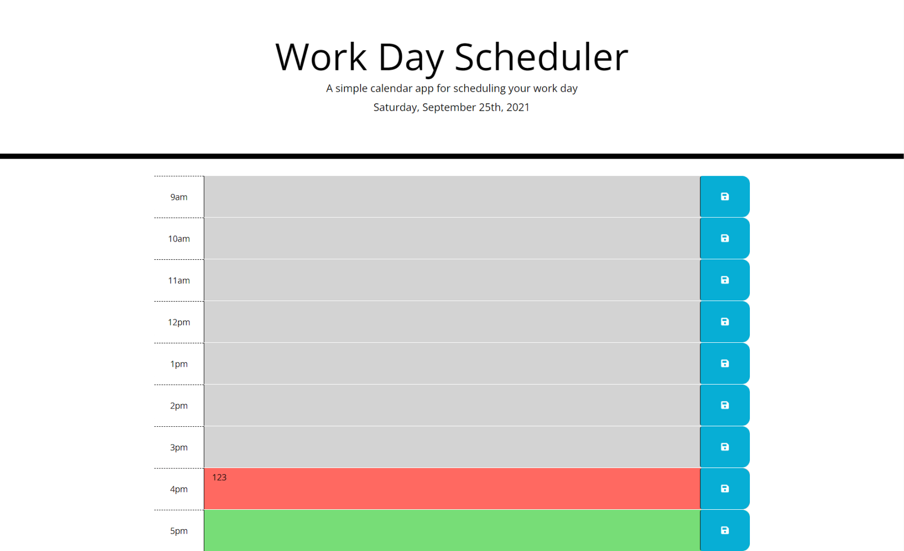

# Challenge: Work Day Scheduler 

## Description
Create a simple calendar application that allows a user to save events for each hour of the work day, 9am-5pm. This app will run in the browser and feature dynamically updated HTML and CSS powered by jQuery.

### Deployed Website Link
https://brynne-eastman.github.io/Work-Day-Scheduler-Challenge/

### Screenshot
